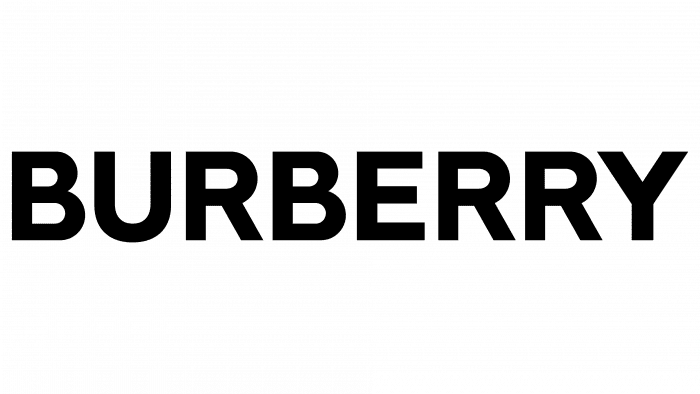

Logos that are produced by the brands are one of the most important components that define the story and the perception of a brand.  The designers have a very hard task in front of them to design a timeless, elegant logo that will associate the brand with the appropriate message.  That’s when the typography design is needed, to make the specific reaction on a customer. In this article I will explore the luxurious fashion brands, such as: Tiffany&Co, Prada, Louis Vuitton, Jimmy Choo and Burberry. According to Bill Gardener who is a designer: Luxury isn’t connoted with fussy extras; no-nonsense boldness is the rule. “Spartan solutions have been rampant in all areas of design,” Gardner says.

### **TIFFANY&CO**

In its logo uses a very high contrast with the letters, which can be easily associate with the sharpness of diamonds and many more luxurious stones. Gives the idea of high-quality product. The brand is very high quality and respected all over the world and the typography reflects it very well.

### **PRADA**

The Prada logo is bold and instinctive and uses the bespoke modern serif font. One of its characteristics is that the logo itself is very extended.

### **LOUIS VUITTON**

Once again, an easily noticeable contrast in the logo of the brand, which also gives the idea of power, modernity, and class. Automatically associated with luxuriousness.

### **JIMMY CHOO**

The main characteristic of its logo is the big contrast used in the font. Very thin lines contrast with some thicker lines used in the letters. It gives the consumer the idea that the brand is very modern, new, and chic. It also gives some type of power. This gives the dynamic and strong experience associated with luxuriousness.

### **BURBERRY**

The logo itself hasn’t changed that much for the past 100 years when the company was firstly established. The main differences can be seen between the weight of the typographic design of both logos, as well as the choice of. A different font. What’s interesting, the font itself has been changed from a chicer and classier one to one with more circular edges of the letters. This moderation may suggest that the logo is more adapted for the digital purposes rather than the printed ones. Another difference can be observed in the weight of the logo. The previous one was light weighted compared to the new one. What’s also important is the condensation of the letters in both logos. The newly; presented one is more condensed and gives the vibes of a more modern and more digitally adapted brand.

What all these brands have in common is the fact that they are all associated with luxurious, high-quality products. Doesn’t matter if it’s jewelry, clothes, or shoes. Each of the brand through its typographic design of the logo, clearly sends the message of an iconic and respected brand. I believe that this phenomenon is hidden in the simplicity of the logos used. Not only are these the easiest fonts but also, they are not decorated in any type of way, they are clear, easy to read, rather sharp edges and high contrast with letters. Through comparison of these luxurious brands, we can also easily deduce what we as customers find chic, luxurious and high-quality. The simplicity is what I believe the feature that we are looking for as it can create a timeless logo.