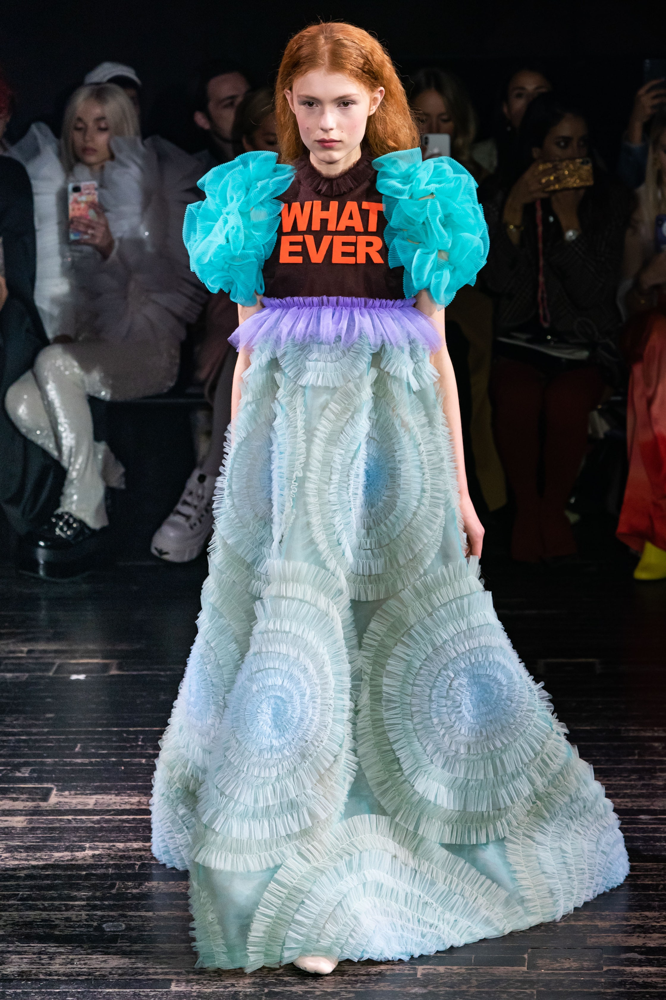

As it turns out, typography is a huge part of fashion industry. And I don’t mean the importance of brand’s label or logo.  Some of the best-known fashion designers took the idea of sending a message through fashion on a completely different level with the use of typography. In this article, we will focus on the interpretation of messages used by *Viktor&Rolf*, as well as the analysis of chosen fonts, colours, and design in general. This unique idea of putting words on the haute couture collection of clothes was presented by *Viktor&Rolf* in one of their fashion shows back in 2019.

The bold statements and the highest quality design made them one of the best-known fashions shows ever.  Let’s not however forget that if it wasn’t for the snarky lines used on their designs, the show probably would not be that memorable.

**THE SNARKY LINES ON THE DESIGNS**

All the lines were slogans or inspired by Instagram-popular captions that reflect today’s world. First and a very important characteristic is the choice of these slogans. All of them are sarcastic, very casual and related to the trends from gen-z generation. However, that’s not all of it. Another important factor is the choice of typographic design of these slogans. Most of them are made of some very bold colours, such as red, green, blue. The statement itself is rather big and all the letters are in capital blocks. It automatically focuses the attention of the observer not on the deign but on the written in the front statement.

In this case we can easily say that the words stole the show. All the assorted typography and graphic design have stolen the show. The slogans on the projects were the answers for many bothering questions, such as: What is your position on climate change?

**OUR OWN INTERPRETATION**

However, the fashion designers said themselves that they do not force anyone to think in a certain way but rather give the consumers topics to think about without forcing any specific perspective. On the other hand, we can see these huge, bold-coloured statements which even though officially do not implement any meaning, they still influence one’s perception of the answer.

**THE POWER OF TYPOGRAPHY**

That’s when we can talk about the power of typography in its finest form. Thanks to the use of bold capital letters, colours, and huge size of statements the messages sent by the designers are strong and clear. Without one of these components the message would not be that powerful. Therefore, all of these 3 features are very important while talking about the power of typography and answering the question-in this case clothes can definitely speak for themselves.