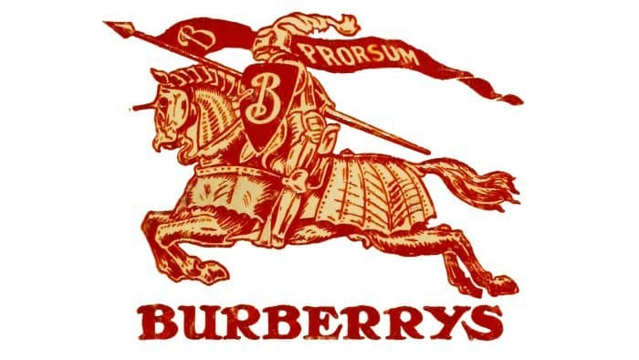
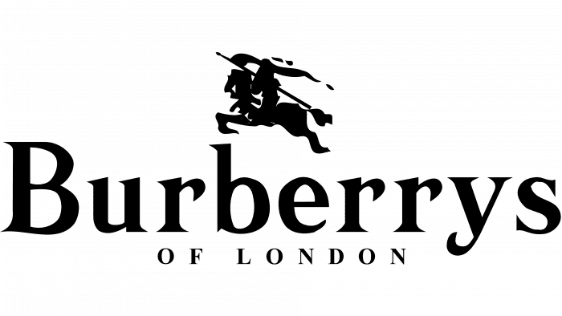
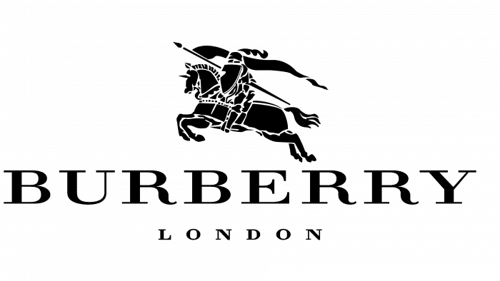

The process of rebranding a brand is natural after some period of time has passed. We need to do it to keep the brand within the trends and preferences of the customers. The main thing that is changing in this process is the design of the brand, such as logo or for instance the Internet website. In the previous article we were introducing some general rules and characteristics for the fashion brands that are associated with luxury; today we are going to explore the rebranding process together with the changes that occurred in the logos.

Through many years the brands new to adapt to the new outgoing trends and design. However, what’s interesting is the fact that in the past many well-known brands used completely different designs. Typographic logos are one of the most important things while creating a brand. The logo can literally speak for itself. The message that is sent through the logo design can either implicate whether the brand is luxurious, classy, chic, or maybe cheap. 

**LUXURIOUS BRANDS**

One thing that can be recently noticed on the market is that most of the luxurious brands such as Burberry or Saint Lauren have recently changed their brand’s logos. One of the changes was the modification made to a font-surprisingly both companies decided to go for almost the identical style choosing the same fonts. I am going to explore this idea based on the example of Burberry. 

**BURBERRY**

The old Burberry word mark hadn’t changed much since its “equestrian knight” was registered more than 100 years ago, therefore it felt like the perfect time for changes. The first logo that was introcuded in 1901 lasted for almost 70 years.

\    1901-1968

Then they decided to modarate it a bit and in 1968 the deisgners presented a new, more modern version of the previous logo. The major change happended in the use of colors and the fact that under the name of fashion house the 'Of London ' phrase is added.

\    1968-1999

Another redeisgn happened in 1999 when the desgners decided to give some balance to the logo. They did it by changing the phrase 'Of London' to 'London' and changing the size of it to a smaller one. They have also decided to refuse the letter 's' at the end of the name of the fashion house. 

The last stage is the new logo that was introduced in 2018 -so quite recently , and is till today-is the official logo of the fashion house. Its has a bolder look with a geometric sans-serif treatment. It’s definitively louder than the previous one, which gives it more powerful look than before. It was created by graphic designer Peter Saville, famous for his Factory Records album covers in the 1980s.

**OTHER BRANDS**

By this change Burberry infecund many others luxurious and pricey brands that have also opted for the all-caps sans-serif look, such as Céline, Rimowa, Diane von Furstenberg, Balenciaga, and Saint Laurent, as well as Saville’s own refresh of Calvin Klein in 2017. 

 Sarah Hyndman, who is a very well-knowna London designer  has spent years playfully testing associations between typography and luxury. After asking hundreds of people in surveys to respond to fonts as “cheap,” “expensive,” or somewhere in between, she found that most consumers tend to view high-contrast fonts with thin hairlines, such as the old Burberry logo, as more high-end. Script treatments—such as the one that renders “London, England” beneath the word mark—might aim to suggest the sophistication of a Bordeaux wine label, but in a fashion context they come across as pretentious.)