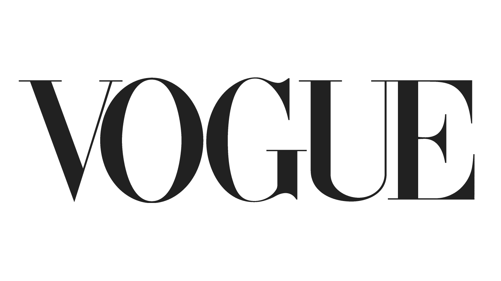
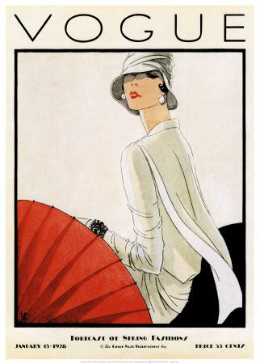
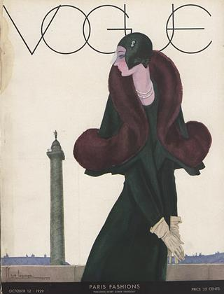
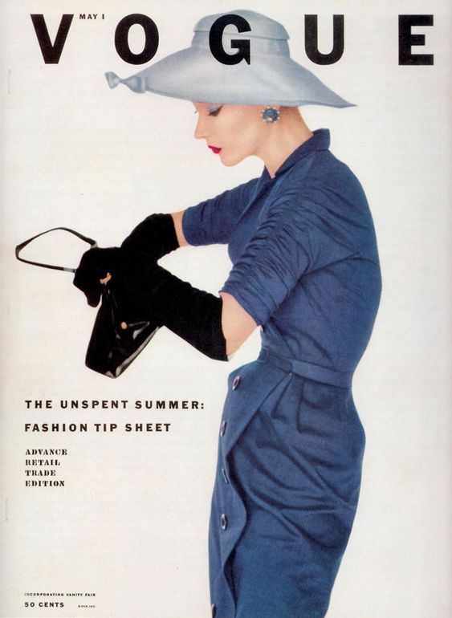

As the perfect example of successful usage of typography is Vogue magazine which is found one of the most influential and luxurious fashion magazines in the world. The iconic font that the magazine is keep using till this das was presented by the designers back in 1945.  Before this presentation of one consistent cover font, the magazine used many decorative fonts that fitted the idea of photo cover.  In today’s world it’s almost impossible to visualize Vogue magazine without their font. I am pretty sure that almost everyone is able to recognize the iconic front font.

### **THE CHANGES**

Even after agreeing to use one font only on their covers, the magazine still changes the colors of the used font making it more suitable for the front cover photoshoot. Even though the colors vary from issue to issue, in general they picked from one color pallet which makes them repetitive from time to time.

### **FONTS IN VOGUE**

The main font style that is used in every single Vogue magazine is ‘Didot’. We can see it on every single cover page as it used for the iconic ‘VOGUE’ logo. Didone fonts were developed by Firmin Didot, Giambattista Bodoni and Justus Erich Walbaum, whose iconic typefaces, Bodoni, Didot, and Walbaum, remain in use today.

\
The idea of redesign of the Vogue logo can be seen in Vogue magazine. In Vogue’s early pre-photographic covers, illustrators created lettering that worked with the style and spirit of their illustrations. This ethic was carried over as *Vogue*made the transition into the photographic era: photographers and designers created ambitiously varied and inventive approaches that integrated letterforms as part of a total approach to design. But even in those covers that did not integrate the lettering as part of the overall concept, type choices were extremely varied.

In 1955 *Vogue* covers vacillated between serif and sans serif typefaces, as well as script faces and illustrative, letters made from photographs or some other designs. 

It was after 1955 that the magazine appears to have come to the conclusion that they want to make the front covers more united and therefore, they have introduced one style for the Vogue front cover logo. The logo is made of the all-capitals banner headline set in Didone lettering. It has been the same since then, no significant changes have been made.