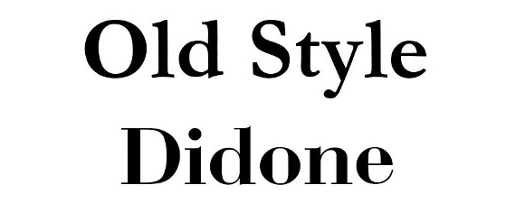
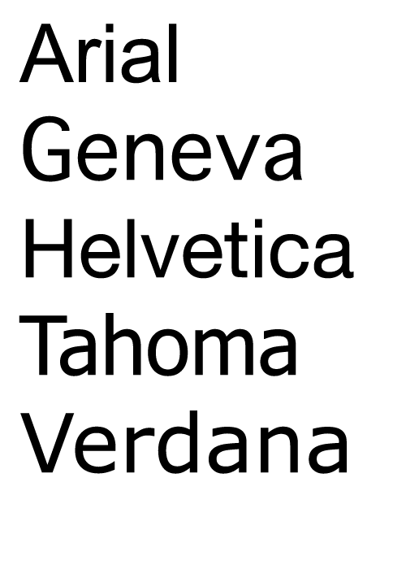
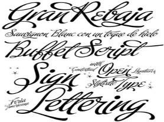
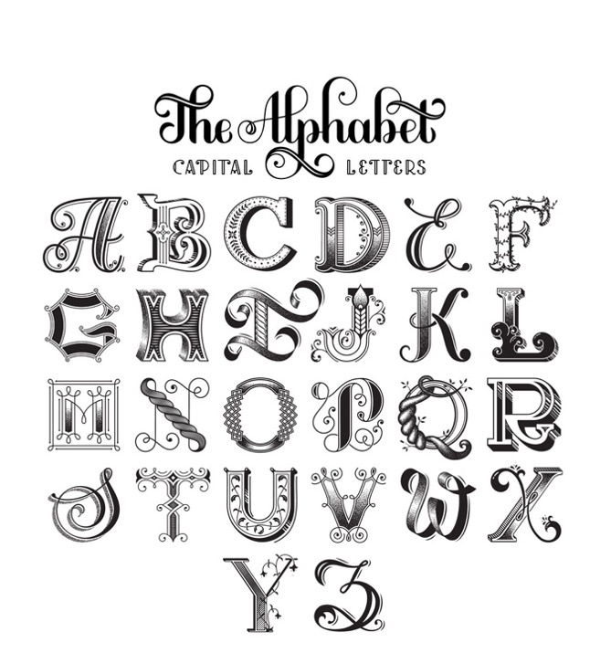

The varieties and styles of fonts can be very overwhelming. Especially while choosing them to create a completely new brand. It is, however, a very important step, especially if you want your brand to be unique and stand out. In this article, you’ll find out how to choose the best possible font that will mirror your brand’s style.

The easiest way (according to many specialists and my own research) is to start with the font classifications. Simply try to determine the fonts that you like.

 

We can distinguish some main classifications:

Serif Type Style-usually better for printed publications, magazines, books.

Some well-known fonts: Didone, Old Style, Times New Roman

 

Sans Serif type Style-work best for the digital versions of the text, such as the social media posts, articles, blogs, etc.

Some well-known fonts: Square Geometric, Humanistic

 

 

Script Type Styles-imitate the handwriting

Its main characteristic: imitates cursive writing

 

Decorative-every another font that is not a serif font and is somehow decorated

  

 

But what font is the best for a clothing brand?

The main consideration should be the style and character of your brand. Try to remember that you’re going to choose a different font for a children’s clothing brand than a luxurious one. You can read more about the luxurious brands and their font choices in my previous article ‘Typographic trends in luxurious fashion brands.’

For a children’s clothing brand probably one of the best options would be to choose a decorative font that is in general more fun and playful.

For a luxurious brand try to choose something simple, yet classic. The best option would be to consider fonts from the ‘Serif Type Style’ Classification.

If your brand wants to represent some modern ideas and has a futuristic character-consider the Sans Serif Type Style. This will give you simplicity and a kind of digitalized character.

These are just some of the general ideas for you to consider. In general-think about the character of your brand first, then everything else will come.