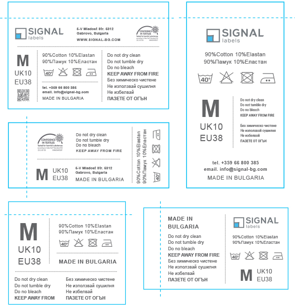

Typography is a tool that helps express the nature and idea of a brand. Some refer to it as a “tool of expression”.
Here is a quick guide on how to create perfect clothing labels using the typography theory.

1. Choose a proper font.
   To create a visually appealing label that will also be clear and easy to read for the customers, you need to rethink your choice of font. 
   First of all, try to choose a font that will be practical for people from different countries. It is especially important if your product is available on the international market. You need to think about what fits best your customers. And they will support multiple languages.
   Second of all, choose a font that is easy to print. Therefore, focus rather on non-decorative types and styles of fonts. The perfect option here could be the sans serifs fonts that are perfect for computer usage, hence they are going to be much easier to read for the customers.
   The last thing to remember while choosing the right font is to pair maybe 2 or 3 different styles of fonts together to keep it clear and easy to ready for the customers. By doing it the label is easy to read and is not messy. 

   
2. Layout of the label.
   You need to remember that while creating a label you have a small amount of space that needs to fit all of the important information. Therefore, the layout is very important. But it also references point 1 that is all about clarity and choosing fonts that are clear and easy to read. You should avoid decorative fonts as they can disturb the whole layout of the label.
3. Formatting 
   You need to remember that choosing the right font is not everything. Formatting and styling this font is just as important. We have the information, we have the grids now we should professionally format the text.
   Try to remember the followings:
   •	Sizing-do does not use letters smaller than 3mm as the customers won’t be able to read them
   •	Contrast-very important tool, especially when you want to divide the information and make it more readable, as well as distinguish some information
   •	Aligning watch out for the alignment of the text paragraphs
   •	Hierarchy - keep the size of the lines in the hierarchy using different sizes and width for more important information