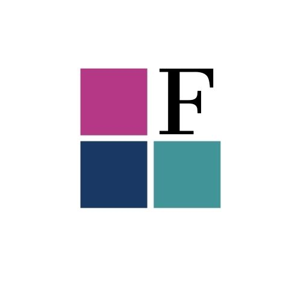
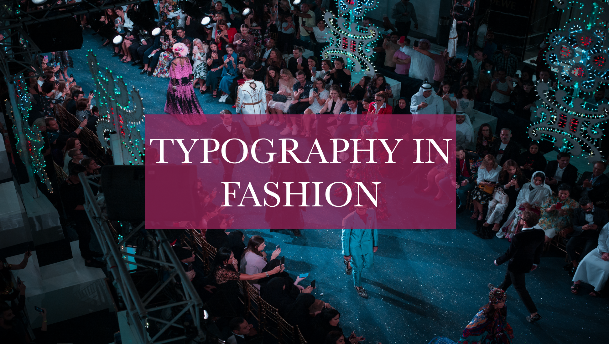

‘Typography in Fashion” is a website highly related to luxurious fashion brands, magazines and fashion shows. It covers all of the possible typographic trends within the area of fashion.

I am on the lookout for examples in the fashion industry and prove that typography is an inseparable element of fashion.

## My logo and banner image

I decided to use a photo from a fashion show as a banner to my website. The photo was taken by Michael Lee on one of the fashion shows.

It is made of darker colours, such as fusion and navy. This gives the idea of luxuriousness and chicness. 

In order to make my logo coherent with the whole website I have decided to use the colour palette from the banner image (therefore from the Michael Lee’s photo) and create something simple, modern and elegant. Here is my logo:

And here is my banner image:

The name of my site is rather a very self-explanatory. I decided to name it ‘Typography in Fashion’. All of the areas of fashion are included! All of the high-fashion-related topics are being explored. Starting from logos of the luxurious brands and ending on controversial fashion shows. There is no space for tabu.

Enjoy your stay here and hopefully you are going to stick with me for a longer time!